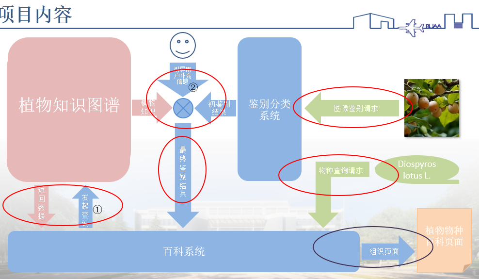

## 问答中可以使用的属性（来自NER）

chinese_tags = ("工业价值", "药用价值", "食用价值", "栽培价值", "保护和改造环境价值", "高度", "胸径", "叶片形状", "树皮形状", "果实形状", "花朵形状", "树冠形状", "花朵颜色", "树皮颜色", "叶片颜色", "果实颜色", "花期", "果期", "病害名称", "虫害名称", "光照", "温度", "抗逆性")

tags = ('IND_VALUE', 'MED_VALUE', 'EDI_VALUE', 'CULT_VALUE', 'PRO_VALUE', 'HEIGHT', 'DIAMETER', 'SHP_LEAF', 'SHP_BARK', 'SHP_FRUIT', 'SHP_FLOWER', 'SHP_CANOPY', 'COL_FLOWER', 'COL_BARK', 'COL_LEAF', 'COL_FRUIT', 'TIME_FLOWER', 'TIME_FRUIT', 'DISEASE', 'PEST', 'ILLUMINATION', 'TEMP', 'RESILIENCE')

1. 工业价值ind_value
2. 药用价值med_value
3. 食用价值edi_value
4. 栽培价值cult_value
5. 保护和改造环境价值pro_value
6. 高度height
7. 叶片形状shp_leaf
8. 树皮形状shp_bark
9. 果实形状shp_fruit
10. 花朵形状shp_flw
11. 花朵颜色col_flw
12. 树皮颜色col_bark
13. 叶片颜色col_leaf
14. 果实颜色col_fruit
15. 病害名称disease
16. 虫害名称pest
17. 光照illumination
18. 温度temp
19. 抗逆性resilience
20. 生活型

## 接口类型

* 百科的接口

  * 接收最终鉴别结果，并向植物图谱发起查询√
    * 结果形式为？
    * 发起查询，查询什么？
    * 收到植物学名，将它所有的结果以自然语言字符串返回出来，成为一个列表
      * 中文名c_name
      * 别名common_name
      * 全部性状characteristics（需要做成一个自然语言表达句来返回）
      * 植物学分类(类似于c_family)
      * 分布distribution
      * 描述description
  * **综合接口**：从鉴别分类系统中获取初步鉴别结果，向用户提问引导补充信息，得到最终鉴别结果√
    * 初步鉴别结果的形式？
      * n * <植物学名，置信度>
    * 如何提问来引导用户？
      * 情况1，先判断：若a、b、c...均含有性状1（性状1是什么，需要对属性类别进行提前地分辨，最好是能够分得越开越好，然后做一个分的最开的排序，人工或模型来完成分辨排序工作），则提问为：
        * 您想查询的植物的<性状1>为<a的性状1>还是<b的性状1>？
        * 它选择了哪一个选项，最终鉴别结果也就是这个选项。
      * 情况2（较为通用），在情况1之后，针对候选植物a,b,c，提问为：
        * 您想查询的植物是否有以下性状？
          * a的性状1
          * b的性状2
          * c的性状3
        * 它选择了哪一个选项，最终鉴别结果也就是这个选项。
    * 用户返回的数据就是根据选项框结果来判断选择了哪种植物。
  * 用户输入植物物种来查询？√
    * 设计时首先以用户键入自然语言然后获取信息来设计，实在不行再考虑选项框
    * 对用户键入的自然语言进行模板匹配。
      * 匹配的时候，遍历植物，对于每种植物，只要出现了植物X的中文名或别名，则匹配该植物对应的学名，然后送入植物知识图谱中去查找。
  * 百科前端
    * 页面设计
      * 可上传图片的地方
      * 可输入文字的对话框
      * 可以下拉选项的选择框
      * 可以显示文字的地方
  * 根据属性来查植物：
    * 限定几种属性
      * 1.植物学分类，包括了6个级别都要弄
      * 2.省份、地区、国家
      * 3.别名
    * 最好能做到能查这些属性的所有值 和根据某个具体的属性值查具有这个属性值的植物
      * 等待用户第一步选择以上属性名
      * 根据用户选择的属性名，返回该类属性的所有属性值
      * 根据该属性值，查具有该属性值的植物
* 鉴别分类系统

  * 输入图像，鉴别得到模糊结果，这些结果形式为 若干个<植物，置信度>对
* 植物知识图谱√

  * 接收查询需求，完成查询，并返回数据

现在从芃均处可以得到 从 图谱返回数据，百科系统进行NER属性抽取的部分。现在要考虑如何将属性抽取出来的结果result.json变为可以用的
